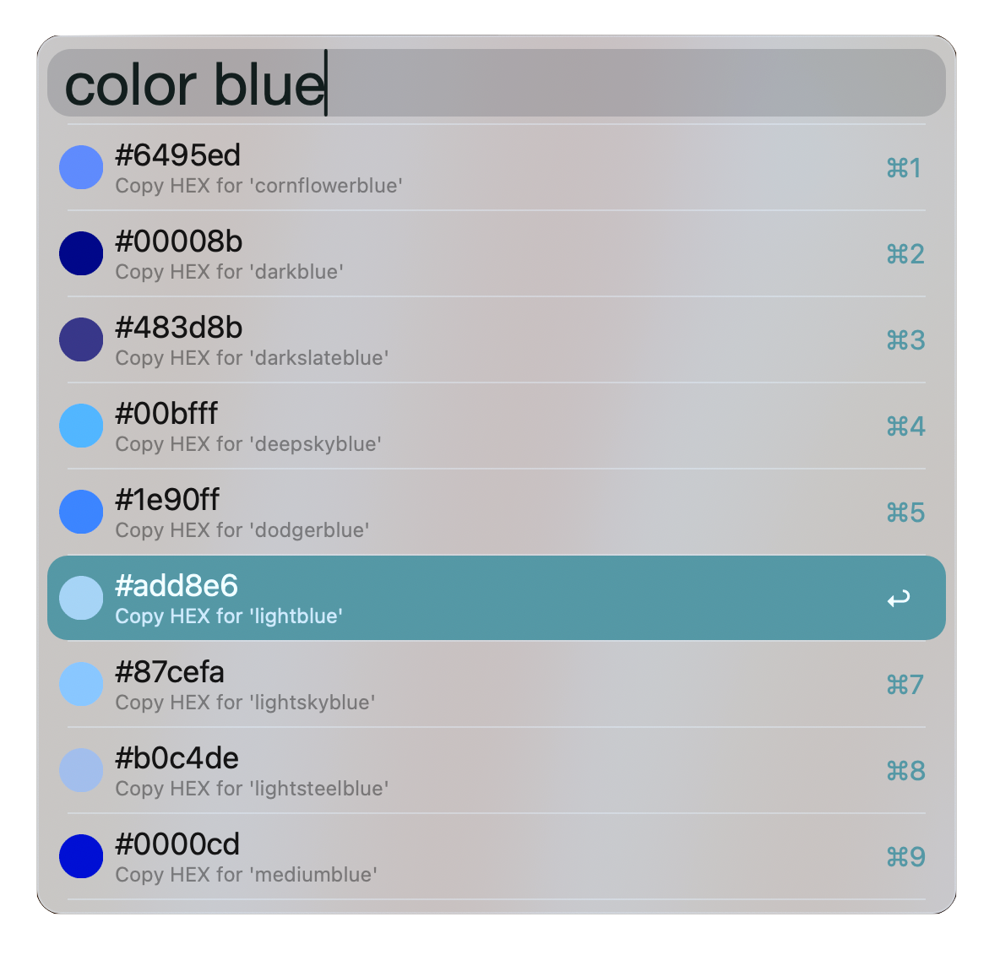

# Color Name to Hex – Alfred Workflow

A simple Alfred workflow that allows you to search CSS color names and copy their HEX values with a circular color preview icon.

## Features

-   Type `color pink`, `color blue`, etc. to search for a named CSS color
-   Displays a circular thumbnail preview for each color
-   Press Enter to copy the HEX code to clipboard

## Preview

