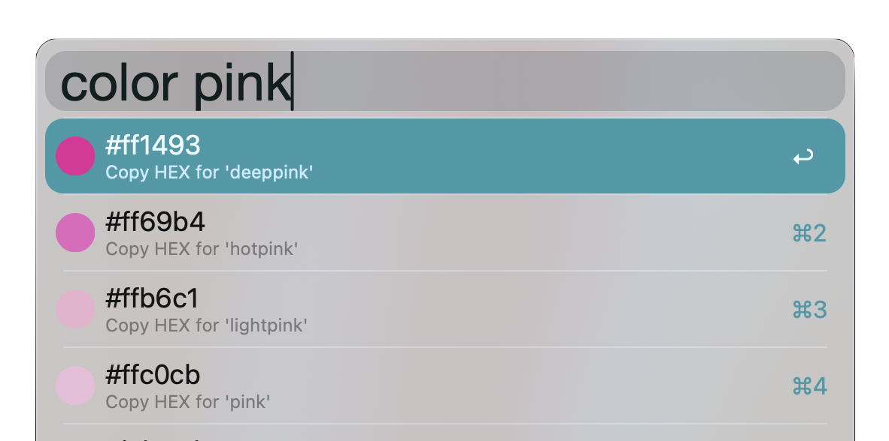

# Color Name to Hex – Alfred Workflow

A simple Alfred workflow that allows you to search CSS color names and copy their HEX values with a circular color preview icon.

## Features

-   Type `color pink`, `color blue`, etc. to search for a named CSS color
-   Displays a circular thumbnail preview for each color
-   Press Enter to copy the HEX code to clipboard

## Preview

## How it works

-   All valid CSS color names and their HEX codes are stored in a dictionary in `colorname.py`
-   When you search, the script filters for matching names and dynamically generates a circular PNG thumbnail for each result
-   The thumbnail is stored in the `icons/` folder in the same directory as your script
-   Alfred displays the color name and HEX code, and copies the HEX value on selection

## Example

Typing: `color pink`

Will display: `#ffc0cb – copy HEX for 'pink'` With a pink circular thumbnail.
By selecting, the HEX value will be copied to your clipboard.

